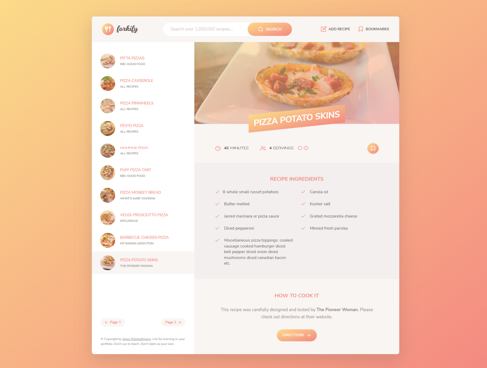

  

    <h1>Forkify</h1>
     
    
A modern looking recipe searching app when you don't know how to cook something

    <h3><a href="https://forkify-cem.netlify.app/">🔗 Link to the Website</a></h2>
    
  

## Built with

## Features

- MVC Pattern
- Personal API for the recipes
- Add a new recipe
- Bookmark a recipe
- Quantity changes according to the number of guests

## Context of the Project

This is a part of a JavaScript course that i've completed on Udemy
